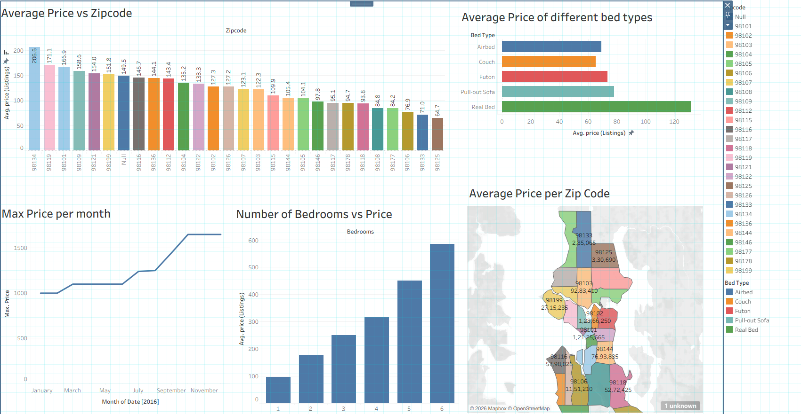

# 🏡 Airbnb Listings Analysis Dashboard | Tableau

An interactive Tableau dashboard built to analyze Airbnb listings in Seattle using the 2016 Airbnb Listings dataset. This project explores pricing trends across zip codes, bed types, bedrooms, and time, helping uncover patterns in the Airbnb rental market.

---

## 📌 Project Overview

The objective of this project is to analyze Airbnb listing prices and identify factors that influence rental costs. The dashboard provides an interactive view of listing prices across different locations and property characteristics.

---

## 📊 Dashboard Preview

---

## 🎯 Objectives

- Analyze average listing prices across different zip codes.
- Compare average prices for different bed types.
- Understand how the number of bedrooms affects listing prices.
- Track maximum listing prices throughout the year.
- Visualize geographical price distribution using a map.

---

## 📈 Dashboard Features

### 📍 Average Price vs Zip Code
- Compares the average listing price across various zip codes.
- Identifies the most and least expensive areas.

### 🛏️ Average Price of Different Bed Types
- Compares pricing among:
  - Airbed
  - Couch
  - Futon
  - Pull-out Sofa
  - Real Bed
- Highlights how bed type influences listing prices.

### 🏠 Number of Bedrooms vs Price
- Shows the relationship between the number of bedrooms and average listing price.
- Demonstrates how larger properties generally command higher prices.

### 📅 Maximum Price per Month
- Displays monthly changes in the maximum listing price during 2016.
- Helps identify seasonal pricing trends.

### 🗺️ Average Price per Zip Code (Map)
- Interactive geographical visualization of average listing prices.
- Makes regional price comparisons easy.

---

## 🛠️ Tools & Technologies

- Tableau Public
- Microsoft Excel
- Data Visualization

---

## 📂 Dataset

**Dataset:** Airbnb Listings 2016 Dataset

The dataset contains public Airbnb listing information from Seattle, including listing prices, bedrooms, bed types, locations, availability, and other property details. :contentReference[oaicite:0]{index=0}

Dataset Source:
https://www.kaggle.com/datasets/alexanderfreberg/airbnb-listings-2016-dataset

---

## 📌 Key Insights

- Listing prices vary significantly across different zip codes.
- Properties with **Real Beds** have the highest average listing prices.
- Average listing price generally increases with the number of bedrooms.
- Some months experience noticeably higher maximum listing prices, indicating seasonal demand.
- Geographic visualization reveals pricing clusters across Seattle neighborhoods.

---

## 🚀 How to View the Dashboard

### Tableau Public
https://public.tableau.com/views/AirBnBListingsDashboard_17851718390090/Dashboard1?:language=en-US&:sid=&:redirect=auth&:display_count=n&:origin=viz_share_link

---

## 📚 Skills Demonstrated

- Data Visualization
- Dashboard Design
- Business Intelligence
- Interactive Reporting
- Geographic Analysis
- Trend Analysis
- Tableau Calculations
- Data Storytelling

---

## 👤 Author

**Mukul Chandela**

---

## ⭐ If you found this project interesting, consider giving it a star!
